<b>Español</b> &nbsp;·&nbsp; <a href="README.en.md">English</a>

 

<picture>
  <source media="(prefers-color-scheme: dark)" srcset="assets/header-dark.svg">
  <source media="(prefers-color-scheme: light)" srcset="assets/header-light.svg">
  
</picture>

Desarrollador en formación. Me gusta construir cosas que funcionen bien  
y entender por qué funcionan.

 

 

## Ahora mismo

<table>
  <tr>
    <td width="170">ESTUDIANDO</td>
    <td>Máster de FP en Inteligencia Artificial y Big Data · <b>Alan Turing</b></td>
  </tr>
  <tr>
    <td>APRENDIENDO</td>
    <td>Python, Inteligencia Artificial y Big Data</td>
  </tr>
  <tr>
    <td>OBJETIVO DEL AÑO</td>
    <td>Aprender todo lo que pueda sobre <b>IA</b>: modelos, datos y todo lo que los rodea</td>
  </tr>
  <tr>
    <td>ABIERTO A</td>
    <td>Hackathons y colaborar en proyectos interesantes</td>
  </tr>
</table>

 

## Stack

DEL DÍA A DÍA

  <picture>
    <source media="(prefers-color-scheme: dark)" srcset="https://skillicons.dev/icons?i=ts,kotlin,py,angular,html,css&theme=dark">
    
  </picture>

TAMBIÉN HE TRABAJADO CON

  <picture>
    <source media="(prefers-color-scheme: dark)" srcset="https://skillicons.dev/icons?i=cs,django,flutter,androidstudio,git,vscode&theme=dark">
    
  </picture>

 

## En números

  <picture>
    <source media="(prefers-color-scheme: dark)" srcset="https://github-readme-stats.vercel.app/api?username=roomeroo&locale=es&show_icons=true&hide_border=true&bg_color=00000000&title_color=e6edf3&text_color=8b949e&icon_color=9d85ff&ring_color=9d85ff">
    
  </picture>
  <picture>
    <source media="(prefers-color-scheme: dark)" srcset="https://github-readme-stats.vercel.app/api/top-langs/?username=roomeroo&locale=es&layout=compact&langs_count=6&hide_border=true&bg_color=00000000&title_color=e6edf3&text_color=8b949e">
    
  </picture>

<picture>
  <source media="(prefers-color-scheme: dark)" srcset="https://github-readme-streak-stats.herokuapp.com/?user=roomeroo&locale=es&hide_border=true&background=00000000&stroke=30363d&ring=9d85ff&fire=9d85ff&currStreakNum=e6edf3&sideNums=e6edf3&currStreakLabel=9d85ff&sideLabels=8b949e&dates=8b949e">
  
</picture>

 

<picture>
  <source media="(prefers-color-scheme: dark)" srcset="https://raw.githubusercontent.com/roomeroo/roomeroo/output/snake-dark.svg">
  <source media="(prefers-color-scheme: light)" srcset="https://raw.githubusercontent.com/roomeroo/roomeroo/output/snake-light.svg">
  
</picture>

 

Gracias por pasarte. Si algo de lo que hago te interesa, escríbeme.

